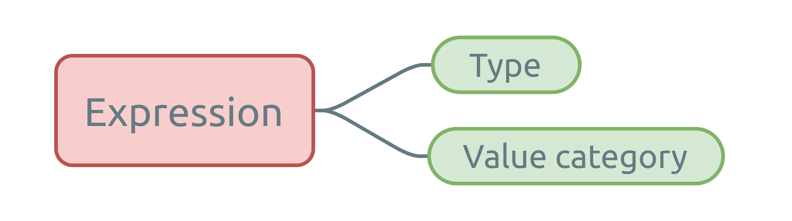
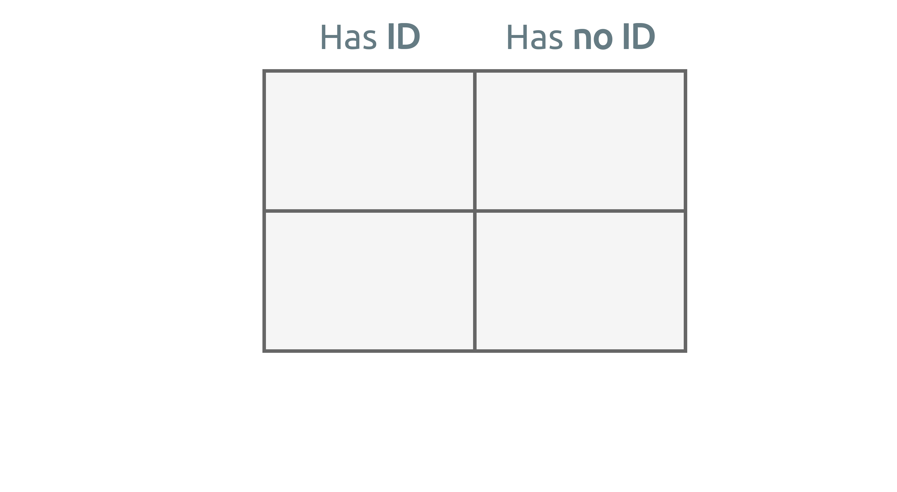
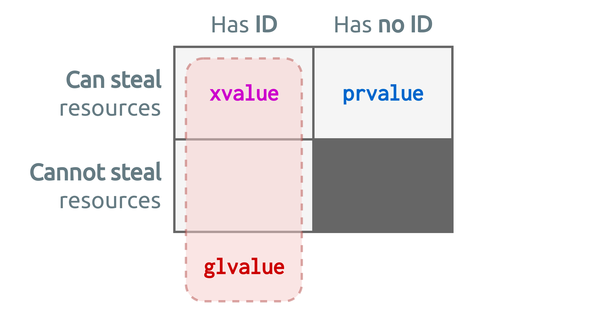
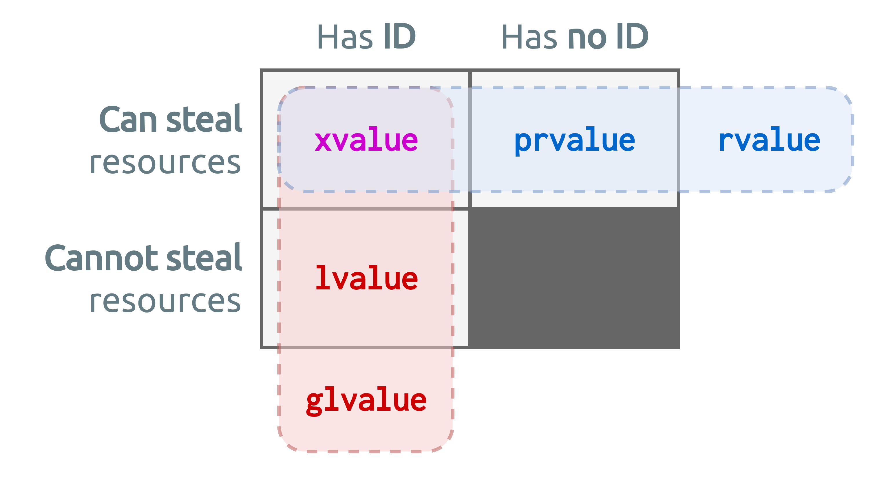
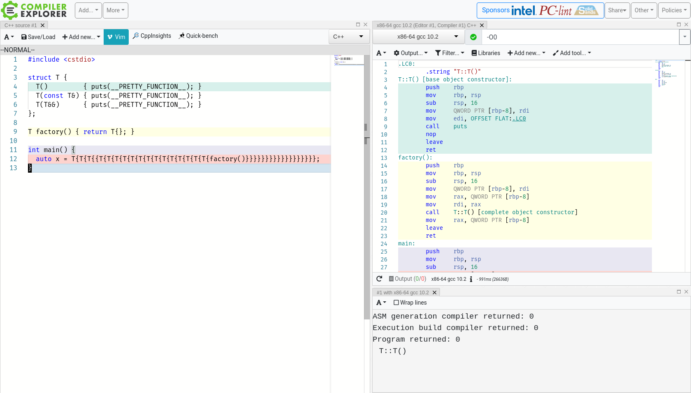
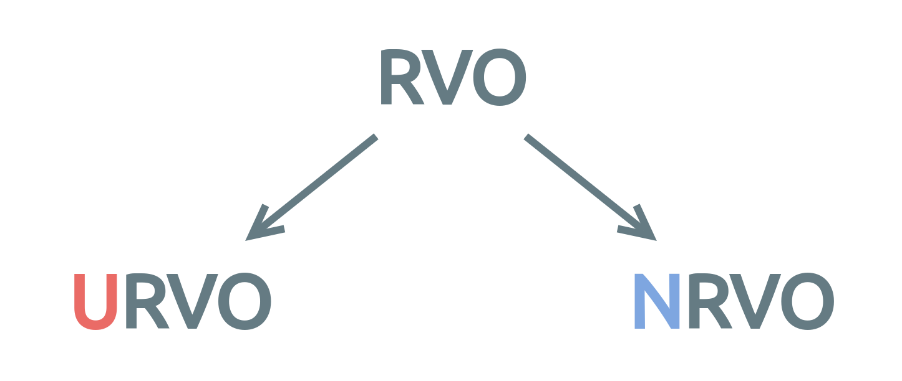
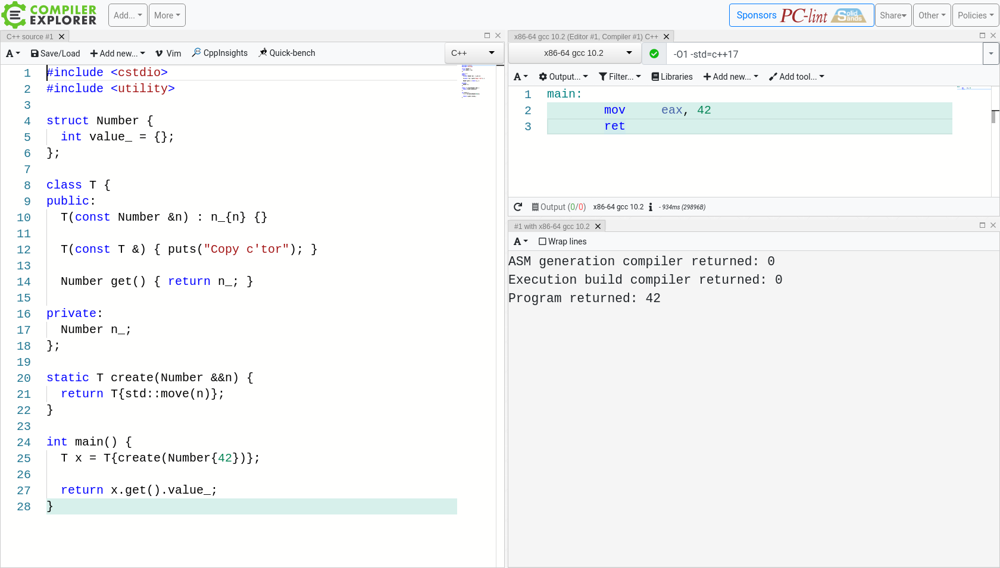
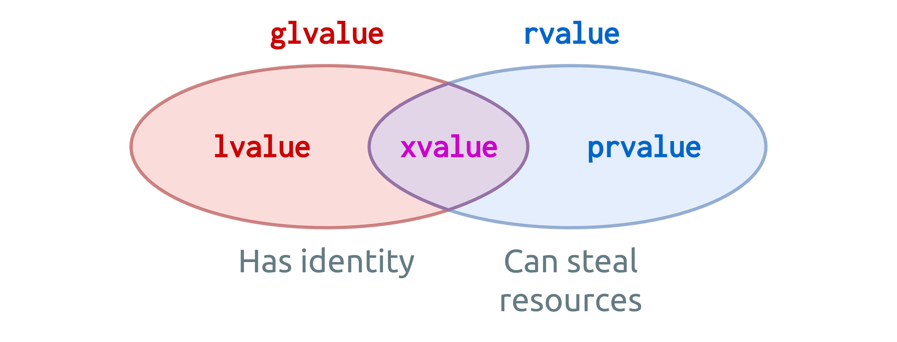

# What's ahead?

* **What are value categories?**

. . .

*(questions)*

* **Value categories in the wild**

. . .

*(questions)*

::: notes
Hi, and welcome to my talk on C++ value categories.
Let me start off by asking you a rhetorical question: who in here has heard about lvalues/rvalues/etc. but has a blurry understanding of it?
I bet there's at least some of you who know a little bit about them, but who are not confident about their knowledge.
Perhaps you're even confused of all the information on value categories out there.
And, perhaps you don't even know what I'm talking about -- that's fine, we're going to fix that!

Let's get started!

A little table of contents: I split the talk up in two parts: the first part is specifically about value categories, and the second part it about their practical applications.
There's two slots for questions, halfway and at the end, I'd like you to save your questions for those moments.
:::

## A little bit about me

{ width="7%" }
{ width="7%" }
{ width="7%" }
{ width="7%" }
{ width="7%" }

[kris@vanrens.org]()

:::notes
A little bit about me: I'm Kris.
I'm lead developer at ViNotion, a computer vision company here in Eindhoven.
We make products that use video data to perform automated analysis such as multimodal traffic counting.
We exploit machine learning algorithms on GPUs for our vision processing, and build our product software in C++.
Outside of work I'm a husband, father of two, guitarist in a metal band and an avid runner and occasional climber.
For any questions or comments, don't hesitate to reach out to me by e-mail or LinkedIn.
:::

## Quiz

::: columns
:::: column
```c++
struct Number {
  int value_ = {};
};

class T {
public:
  T(const Number &n) : n_{n} {}

  T(const T &) { puts("Copy c'tor"); }

  Number get() { return n_; }

private:
  Number n_;
};
```
::::
:::: column
```c++
static T create(Number &&n) {
  return T{std::move(n)};
}

int main() {
  T x = T{create(Number{42})};

  return x.get().value_;
}
```
What's the output?
::::
:::

::: notes
The question is: what is the output of this code?
Both in terms of assembly code and standard output messages.

Just take some time to read this.

...

Remember or write down your answer.
We're going to revisit this quiz code a couple of times during this presentation.
:::


# What are value categories?

## It all starts with...

::: notes
Let's get cracking!
Before we get on though, I'd like you to temporarily forget everything you know about value categories.
Be open-minded about what I have to say, it's not hard at all to understand correctly.

So, what are value categories?
Value categories are about ...
:::

## ...expressions!

. . .

> Value categories are <strong>not about objects or class types</strong>, they are about <strong>expressions</strong>!

::: notes
This is a very important bit of information.

...
:::

## I mean, seriously...

::: notes
...
:::

## ...expressions!

::: notes
Now, I'm repeating this, because it is key to understanding value categories.
And it's where most people go wrong in the understanding of value categories.

If you're going to leave this presentation early, fall asleep, whatever -- at least remember this: value categories are about expressions.

If expressions are that important, what is an expression?
:::

## What is an expression?

> An expression is a sequence of operators and their operands, that specifies a computation.

::: notes
...

OK, operators and their operands specifying computations.
A very general and often used concept in your code.
In fact, I reckon about half of your code is expressions, so value categories are relevant for a large part of your code.
Expressions live alongside statements, and are often parts of statements.
:::

## Expression outcome

> Expression evaluation may produce a result, and may generate a side-effect.

::: notes
...

So, an expression may produce a result and have a side-effect.
For those that don't know what a side-effect is: for example: the `printf` function has a side-effect, namely that a string is written to standard output.
Let's look at some examples.
:::

##
### Example expressions (1)

```c++
42  // Expression evaluating to value 42

17 + 42  // Expression evaluating to value 59
```
```c++
int a;

a = 23  // Expression evaluating to value 23
a + 17  // Expression evaluation to value 40
```
```c++
static_cast<float>(a)  // Expression evaluating to floating-point value 23.0f
```

::: notes
Some simple examples.

...
:::

##
### Example expressions (2)

```c++
int a;

sizeof a  // Expression evaluating to the byte size of 'a'
          // Id-expression 'a' is unevaluated
```
```c++
[]{ return 3; }  // Expression evaluating to a closure
```
```c++
printf("Hi!\n")  // Expression evaluating to the number of characters written
                 // Result is often discarded, i.e. a 'discarded-value expression'
```

::: notes
Some more involved examples.

...

Now, where do value categories stand in relation to expressions?
:::

## Expressions in C++

In C++, each expression is identified by two properties:

{ width="60%" }

::: notes
* Type: is some non-reference type,
* Value category: is one of three primary value categories.

Let's take a look at them!
:::

## Primary value categories

. . .

<span style="color:#cc0000">**``lvalue``**</span> -- **L**ocator value

. . .

<span style="color:#0066cc">**``prvalue``**</span> -- **P**ure ``rvalue``

. . .

<span style="color:#cc00cc">**``xvalue``**</span> -- e**X**piring value

::: notes
First, there is the lvalue, or locator value.
Second, there's the prvalue, or pure rvalue.
Lastly, there's the xvalue, or expiring value.

These are the three primary value categories, as described in the C++ standard.

Please note that these alternative names are unofficial.
They can help you memorize the meaning of a value category, but in literature or the standard or articles you'll only find the use of the shortened names.

But probably most of you know about the existence of rvalues, and they're not on the list!
That's because there's more!
:::

## But wait...there's more!

. . .

<span style="color:#cc0000">**``glvalue``**</span> -- **G**eneral ``lvalue``

. . .

<span style="color:#0066cc">**``rvalue``**</span> -- errr**R**rr..value { width="3%" }

::: notes
The previously mentioned value categories were the primary value categories.

But there are two more value categories: the glvalue, or general lvalue, and the rvalue, or errrrrrRrrrvalue.

Now that we know all the value categories there are, let's organize them.
:::

## Back to expressions

Value categories are organized based on expression properties:

1. Does it evaluate to an identity?
2. Can its result resources be safely stolen?

::: notes
...

Remember each expression may evaluate to a result?
This is the result the second property is about.

Stealing resources might sound rather hostile, but really this is the best way to describe it.
Disembowelling could be another candidate, but that doesn't really make it any better I guess..

Let's take a look at some code examples for each of the two properties.
:::

##
### Does it evaluate to an identity?

::: columns
:::: column
```c++
int a;

a  // Has identity
```
```c++
42                // Has no identity
nullptr           // Has no identity
false             // Has no identity
[]{ return 42; }  // Has no identity
"Hi"              // Has identity
```
```c++
std::cout  // Has identity
```
::::
:::: column
```c++
a + 2      // Has no identity
a || true  // Has no identity
```
```c++
a++  // Has no identity
++a  // Has identity
```
```c++
static_cast<int>(a)  // Has no identity
std::move(a)         // Has identity
```
::::
:::

::: notes
...

I'll give you a few seconds to study them.

Right.
The 'has identity' property is basically standardese for being able to take the address of an expression result.

Some standouts:

A string literal has a static storage duration, meaning it has an identity.

Post and pre-increment are slightly tricky.
But when you think about it, it does make sense.

A std::move of something, for those well-versed in move semantics, doesn't really mean there is a move, it's just a value category conversion or cast.
It simply explicitly retags the operand expression for resource reuse.
And its result actually has an identity.
:::

##
### Can its resources be safely stolen?

> Expression result resources can be stolen if it evaluates to an anonymous temporary, or if the associated object is near the end of its lifetime.

. . .

This was the main motivation for move semantics { width="4%" }

::: notes
Now, when can expression result resources be stolen?
Generally, this happens when an expression evaluates to an anonymous temporary, or if the associated object is at the end of its lifetime.

Actually this was the main motivation to add move semantics to C++.

Again, let's look at some examples.
:::

##
### Can its resources be safely stolen?

::: columns
:::: column
```c++
std::string func()
{
  return "Steal me!";
}

std::vector<std::string> vec;

vec.push_back(func());
```
::::
:::: column
```c++
std::string x{"Steal me!"};

std::vector<std::string> vec;

vec.push_back(std::move(x));
```
::::
:::

::: notes
The result of expression `func()` is marked as 'can safely steal the resources from', as it will end its lifetime after being returned.

In the second example, the local variable `x` is explicitly marked for 'can steal its resources'.
:::

## Let's get organized!

::: notes
Now let's get organized and create an overview of all five value categories and the relations among them.
When we're done, we'll get into some more examples.
:::

##

{ width="90%" }

::: notes
First, let's take a table of two by two cells.
:::

##

{ width="90%" }

::: notes
The columns indicate whether or not an expression evaluates to an identity or not.
:::

##

{ width="90%" }

::: notes
The rows will indicate if the expression result resources can be stolen.

Now looking at this table, there's one location that doesn't make much sense.
An object without an identity whose resources cannot be used is a bit of a useless concept.
So we're going to leave that one out.
:::

##

{ width="90%" }

::: notes
In this table we're now going to fill in all the possible expression value categories.
You might wonder how are we going to fit five value categories into three cells?
That's because the cells themselves will hold only the primary value categories, the two leftovers are spanning categories.
Let's start with the first one, glvalue.
:::

##

{ width="90%" }

::: notes
The glvalue category spans the whole left column simply indicating 'has identity'.
:::

##

{ width="90%" }

::: notes
The prvalue category sits in the spot of identity-less objects whose resources can safely be stolen.

This one's a bit more involved.
It's evaluation initializes an object or computes a value.
There's some subtle meaning and implication here to which we'll get back in the second part of this presentation.
For now it's fine to identify a prvalue as a ID-less temporary.

The next one we're going to write down is the xvalue.
:::

##

{ width="90%" }

::: notes
An xvalue sits in an interesting spot; it has an identity and its resources can be stolen.

Next one; lvalue.
:::

##

{ width="90%" }

::: notes
An lvalue has an identity, but its resources cannot be stolen.

Last one to finalize the set: rvalue.
:::

##

{ width="90%" }

::: notes
The rvalue category is another spanning category, like glvalue.
But in this case it basically describes any expression whose result resources can be stolen.

Now all value categories have been filled in.
There's three primary categories, inside the cells, and two spanning categories describing the expression properties in general.

Take a short moment to absorb this diagram.

...

OK, now let's go and look at some examples!
:::

## Examples (1)

::: columns
:::: column
```c++
42  // prvalue
```
```c++
nullptr  // prvalue
```
```c++
"Hi there!"  // lvalue
```
::::
:::: column
{ width="90%" }
::::
:::

::: notes
As integer literals or `nullptr` don't have an identity, they must be prvalues.
Remember a string literal has static storage duration, meaning it has an identity.
And in this example there's no reason to assume its resources can be safely stolen, so it's an lvalue.
:::

## Examples (2)

::: columns
:::: column
```c++
int x = 42;
```
```c++
++x  // lvalue
```
```c++
x++  // prvalue
```
::::
:::: column
{ width="90%" }
::::
:::

::: notes
The increment operators again.

Pre-increment will first increment, and then return a reference to `x`, so this is an lvalue.
Post-increment will return a temporary copy to the unincremented `x`, and then increment, so this is a prvalue.
:::

## Examples (3)

::: columns
:::: column
```c++
int x = 42;
```
```c++
x   // lvalue
```
```c++
std::move(x)  // xvalue
```
::::
:::: column
{ width="90%" }
::::
:::

::: notes
Here we have a local variable `x`, which when used as-is, will be classified as an lvalue.
However when we call the `std::move` operator on it, we will explicitly mark this lvalue as 'resources can be stolen'.
That's when an lvalue changes into an xvalue.
:::

## Examples (4)

::: columns
:::: column
```c++
void func(int &&arg)
{
  // 'arg' is an lvalue

  // 'std::move(arg)' is an xvalue
  other_func(std::move(arg));
}

func(42);  // '42' is a prvalue
```
::::
:::: column
{ width="90%" }
::::
:::

::: notes
A slightly more practical example then.

We have a function `func`, taking an rvalue reference, which calls another function.
In the bottom is the call to the `func` function.

The initial call is done with a prvalue which is integer literal 42.
Then locally, inside `func`, the argument is an lvalue.
And lastly, the function `other_func` is called with an xvalue.
:::

## Examples (5)

::: columns
:::: column
```c++
void func(int &arg);   // #1
void func(int &&arg);  // #2
```
```c++
int &&x = 42;

func(x);  // Which overload is called?
```
::::
:::: column
{ width="90%" }
::::
:::

. . .

Expression `x` is an <span style="color:#cc0000">**``lvalue``**</span>; so overload #1 is called

::: notes
One last example, in the form of a quiz: which function overload is called?

...

The answer is: number 1.
The argument used to call function `func` in this case is an lvalue, resulting in a call to the first function declaration.

Many make the mistake here to think that value categories are about class types, but they're about expressions.
Right?

Before we get into the next part of this talk, I want to quickly tell you someting about the history of value categories.
They have been subject to a lot of change over the years.
:::

## A little side step: history

* CPL (1963) first introduced ``lvalue`` and ``rvalue`` concepts,
* Via BCPL and B came along C, keeping the definitions,
* C++ first followed the C definition up until C++03,
* C++11 introduced move semantics, changing it again.

. . .

Please forget the right-/left-hand notion for today's definition.

::: notes
First, value categories were described in the language CPL or 'Combined Programming Language' from 1963.
It defined lvalues and rvalues by their respective position w.r.t. the assignment operator, either as a left-hand value or a right-hand value.
Out of CPL came BCPL, or 'Basic CPL', then B and then C, all keeping the definitions for value categories.
C++ first also followed these definitions, up until C++03.
Then lastly in C++11 move semantics were added and the value categories were extended.

For modern C++ usage, please forget about this notion of left-hand and right-hand side.
It's outdated.
:::

## OK then. Now what?

* Communication: learn and be literate!
* Reading compiler errors effectively,
* Useful for understanding move semantics,
* Understanding copy elision and implicit conversions.

::: notes
Congratulations! You're now the proud owner of this newly acquired knowledge on expression value categories!
Now what?

Now you can use this information to read more about C++, read articles, books, or --if you really have no live whatsoever-- the standard itself, study!
Value categories are often used in prose about C++.
Also, when consulting reference websites like CppReference or MSDN.
I find that learning more about your programming language of choice will make you a better programmer in the long run.

Compiler errors also tell you about illegal usage of value categories, now you're able to better understand them -- making you a more effective programmer.

Also it can be quite useful to get a good understanding of move semantics, copy elision and implicit conversions.

In the second part of this talk I'm going to tell about copy elision.
But first, we're going to revisit our example.
:::

## Quiz revisited

::: columns
:::: column
```c++
struct Number {
  int value_ = {};
};

class T {
public:
  T(const Number &n) : n_{n} {}

  T(const T &) { puts("Copy c'tor"); }

  Number get() { return n_; }

private:
  Number n_;
};
```
::::
:::: column
```c++
static T create(Number &&n) {
  return T{std::move(n)};
}

int main() {
  T x = T{create(Number{42})};

  return x.get().value_;
}
```
What's the output?
::::
:::

::: notes
Now we should be able to determine all the value categories that are used here.

...

So now that we know what value categories actually are, let's see what they are used for!
:::


# Questions?

{ width="8%" } { width="7%" }

:::notes
This is the end of the first part -- so we're about half way, are there any questions at this point?
:::


# Value categories in the wild

## Copy elision

> A section in the C++ standard that describes the elision (i.e. <strong>omission</strong>) of copy/move operations, resulting in zero-copy pass-by-value semantics.

Restrictions apply { width="4%" }

::: notes
One aspect every somewhat experienced C++ programmer has dealt with is type design and object propagation through function calls.
When a function is called that takes an argument or returns a value, it will propagate in some form or another.
In one situation it's better to use reference semantics, but in some other situation value semantics are fine.
You might save some expensive copies in the process!
When to use what is a bit of art to find out when you're first starting out to program.
This unlimited flexibilty and control comes at the cost of language complexity.

What you might know or not, is that the C++ language itself and tools like compilers actually do all kinds of nifty tricks to help you.
One of these tricks is copy elision.
Which is what we're going to look at now.

...

Copy elision is better to be called "copy and move elision".
Let's dive in!
:::

## Copy elision

> <strong>Permits</strong> elisions, it does not <strong>guarantee</strong>!

. . .

Actual results depend on compiler and compiler settings.

::: notes
Copy elision is a part of the C++ standard, but it only permits the compiler to elide copies or moves, it does not guarantee them.
The compiler and its configuration therefore have a possible influence on the results.
Most compilers even have command flags to fully disable copy elision.

Let's take a look at some examples.
:::

##
### Copy elision in action

::: columns
:::: column
C++ code:
```c++
T func()
{
  return T{};  // Create temporary
}

T x = func();  // Create temporary
```
::::
:::: column
Possible output (1):
```c++
T()
T(const &)
~T()
T(const &)
~T()
~T()
```
::::
:::

No copy elision.

::: notes
Here we declare and initialize an object 'x' from the return value of a function.
Without any form of copy elision there will be one default construction of an object T, and two copy constructions.
One copy construction upon function returning, and one copy construction in the initialization of x.
:::

##
### Copy elision in action

::: columns
:::: column
C++ code:
```c++
T func()
{
  return T{};  // Create temporary?
}

T x = func();  // Create temporary?
```
::::
:::: column
Possible output (2):
```c++
T()
T(const &)
~T()
~T()
```
::::
:::

Partial copy elision.

::: notes
When copy elision is enabled for either a function return or an object initialization, we could possibly see only one copy being made.
:::

##
### Copy elision in action

::: columns
:::: column
C++ code:
```c++
T func()
{
  return T{};
}

T x = func();
```
::::
:::: column
Possible output (3):
```c++
T()
~T()
```
::::
:::

Full copy elision.

::: notes
When copy elision is enabled for both a function return and an object initialization, there are no copies left!
There is only one default construction of a T.
That's great!

Note that copy elision rules are not guaranteed and all presented scenarios are valid output.
:::

## Where can elisions occur?

* In the initialization of an object,
* In a `return` statement,
* In a `throw` expression,
* In a `catch` clause.

::: notes
Where can copy/move elisions occur?
As we just saw, they can occur the initialization of an object, and in a return statement.
Other places they can occur are in throw expressions and the catch clause.

That's great!
:::

## Great stuff!

. . .

Truth is; compilers have been doing it for years.. { width="4%" }

::: notes
Give it to me!
What's the magic key to turn this on?

...

In fact, in most cases the elision even occurs with compiler optimizations turned off!

That's a bit of a let-down eh.
So basically it's old-skool technology applied for years.
Isn't there anything new in the latest few versions of C++?
Actually there is!
:::

## Copy elision since C++17

C++17 added **mandates** to the standard, informally known as:

* "Guaranteed copy elision",
* "Guaranteed return value optimization",
* "Copy evasion".

. . .

A set of special rules for <span style="color:#0066cc">**``prvalue``**</span> expressions.

::: notes
C++17 added some rules to the standard that guarantee copy elision to occur in some situations.
Which is great, because now we don't only have the compilers performing copy elision in practice, we also have the theory to back it up.
Before this, it was just the compiler implementers having to identify the elision scenarios themselves, and as an end user you were dependent on the compiler and its configuration for copy elision to be performed.

What are these cases for guaranteed copy elision?
:::

## Guaranteed copy elision (1)

> If, in an initialization of an object, when the initializer expression is a <span style="color:#0066cc">**``prvalue``**</span> of the same class type as the variable type.

```c++
T x{T{}}; // Only one (default) construction of T allowed here
```

::: notes
The first case is when an object is initialized by an expression that is of the same class type as the object.
Makes sense.
:::

## Guaranteed copy elision (2)

> If, in a `return` statement the operand is a <span style="color:#0066cc">**``prvalue``**</span> of the same class type as the function return type.

```c++
T func()
{
  return T{};
}

T x{func()}; // Only one (default) construction of T allowed here
```

::: notes
The second case is when a function returns a same class type as the function return type.
Here in the initialization of x there is only one construction of T allowed.
And note that only one is allowed -- if this is not the case, there is a bug in your compiler.

All of this goodness is made possible by some clever mechanisms built on top of the value category concepts.
In fact, let's dive in a bit deeper and see what's there!
:::

##

{ width="85%" }

## Under the hood

> Under the rules of C++17, a <span style="color:#0066cc">**``prvalue``**</span> will be used only as an <strong>unmaterialized recipe</strong> of an object, until actual *materialization* is required.

. . .

> A <span style="color:#0066cc">**``prvalue``**</span> is an expression whose <strong>evaluation initializes/materializes</strong> an object.

. . .

This is called a *temporary materialization conversion*.

::: notes
...

Some expensive words here.
Materialization here simply means coming into being.
So this means a prvalue is an object not really into existence until it's necessary to.
When is that then?

...

Aha!
A prvalue is an object that is used in an unmaterialized form, until it's evaluated, upon which it materializes.

This conversion from unmaterialized to materialized form is called a temporary materialization conversion.
Such a great name, it makes for great birthday conversation material!
:::

## Temporary materialization

```c++
struct Person {
  std::string name_;
  unsigned int age_ = {};
};

Person createPerson() {
  std::string name;
  unsigned int age = 0;

  // Get data from somewhere in runtime..

  return Person{name, age};    // 1. Initial prvalue expression
}

int main() {
  return createPerson().age_;  // 2. Temporary materialization: xvalue
}
```

::: notes
An example:

Here we have a struct Person comprising of a name and an age data member.
Then we have some sort of factory function to create a function from data from somewhere, be it user input, be it a database, doesn't matter, but it creates a Person data.
Then in the main function we create a Person data from which we use the age value to return.
It's a bit of a silly example, but it serves the purpose of demonstration.

Here in main it all starts, we call the create function, which builds a Person data and returns a prvalue.
So the result of the function call expression in main is a prvalue.
At this point, there is still no materialized version of this Person data.
The next thing that is done is that the data member age_ is accessed on the result of the prvalue, which forces an evaluation of the prvalue and there we have our temporary materialization.
In order for this age_ data member to be read, there must be an actual Person data somewhere.
What's interesting is that the value category of a temporary materialization conversion result is an xvalue.
:::

## Temporary materialization

> An implicit <span style="color:#0066cc">**``prvalue``**</span> to <span style="color:#cc00cc">**``xvalue``**</span> conversion.

. . .

<span style="color:#0066cc">**``prvalue``**</span>s are not moved from!

::: notes
As we've seen from the example: temporary materialization is a prvalue to xvalue conversion.

Also, prvalues are not moved from.
This is an important observation, as often the 'can resources be safely stolen' property of an expression is described as 'can be moved from'.
But a prvalue is not moved from!
It materializes upon evaluation.
:::

## Temporary materialization

Occurs when:

* Accessing a member of a <span style="color:#0066cc">**``prvalue``**</span>,
* Binding a reference to a <span style="color:#0066cc">**``prvalue``**</span>,
* Applying `sizeof` or `typeid` to a <span style="color:#0066cc">**``prvalue``**</span>,
* Etc.

::: notes
So when will this conversion happen?
As we've just seen: it happens when the prvalue is evaluated, which can be many situations.

...

Let's look at a few more examples.
:::

##
### Temporary materialization in action

```c++
struct T { int value; };

T{}        // prvalue
T{}.value  // xvalue
```
. . .
```c++
auto x = std::string("Guaca") + std::string("mole").c_str();
//     ^                      ^                    ^
//     3                      2                    1
```

::: notes
Again, the most basic example where a data member is accessed, changing a prvalue into an xvalue.

In the bottom example, there are three temporary materializations happening:

* In the member function access of the second string,
* When the operator plus is evaluated,
* When the result of the operator plus is evaluated to initialize object x.
:::

## C++17 copy/move elision

### = Copy elision + temporary materialization

{ width="6%" }

::: notes
And that's how modern-day C++ employs the value categories to define rules for copy/move elision optimizations.

There is however a bit more interesting stuff to talk about.
And that's the topic of return value optimization.
:::

## Return Value Optimization

### AKA 'RVO'

A variant of copy elision.

::: notes
Return value optimization, or RVO, is a variant of copy elision in that it specifically deals with return values of functions.
Whereas copy elision in general deals with any form of elision.
:::

## Return Value Optimization

Two forms:

1. <span style="color:#ea6b66">Unnamed</span> RVO (<span style="color:#ea6b66">U</span>RVO or simply RVO),
2. <span style="color:#7ea6e0">Named</span> RVO (<span style="color:#7ea6e0">N</span>RVO).

::: notes
There are two variants of return value optimization: unnamed and named RVO.
:::

## Return Value Optimization

{ width="70%" }

These terms live outside the standard.

::: notes
The unnamed/named part refers to the type of object that is being returned, be it an anonymous temporary, or a named object.

The term return value optimization lives outside of the standard and forms a collection of rules throughout the standard.

Let's first take a look at unnamed RVO.
:::

## <span style="color:#ea6b66">Unnamed</span> RVO (<span style="color:#ea6b66">U</span>RVO)

Refers to the returning of temporary objects from a function.

&nbsp;

. . .

> <strong>Guaranteed</strong> by C++17 rules.

::: notes
We can be short about unnamed RVO, because it is guaranteed in C++17, great!
So there's nothing to talk about here really, it's a done deal.

Let's look at named RVO then!
:::

## <span style="color:#7ea6e0">Named</span> RVO (<span style="color:#7ea6e0">N</span>RVO)

Refers to the returning of named objects from a function.

::: notes
The best way to demonstrate NVRO is using an example.
:::

## <span style="color:#7ea6e0">N</span>RVO in action

The most simple example

::: columns
:::: column
```c++
T func()
{
  T result;

  return result;
}

T x = func();
```
::::
:::: column
```c++
T()
~T()
```
::::
:::

::: notes
On the left side we have a function func, that declares a local variable which is then returned.
Note that this is different from all the previous examples for copy elision in that in this case an object with an identity is returned.

The right side shows the special member functions that are called.
Just a single default construction and a destruction.

This example can be extended to become slightly more complex.
:::

## <span style="color:#7ea6e0">N</span>RVO in action

Slightly more involved

::: columns
:::: column
```c++
T func()
{
  T result;

  if (something)
    return result;

  // ...

  return result;
}

T x = func();
```
::::
:::: column
```c++
T()
~T()
```
It still works
::::
:::

::: notes
Now the function func has two exit points, both returning the same local object.

And this is great!
Many functions fit to this very format, and NRVO is applied to simplify the generated code.
However..
:::

## <span style="color:#7ea6e0">N</span>RVO is finicky though

::: notes
...

There are many reasons for NRVO to break.
Which is sad.
And in order to explain these situations, I'd like us all to brush up on some background information.
Namely: function call mechanics, or calling conventions.
:::

##
### <span style="color:#7ea6e0">N</span>RVO is not always possible (1)

::: columns
:::: column
Multiple outputs
```c++
T func()
{
  T result;

  if (something)
    return {};  // prvalue

  return result; // lvalue
}

T x = func();
```
::::
:::: column
Output stored elsewhere
```c++
static T result;

T func()
{
  return result;
}

T x = func();
```
::::
:::

::: notes
In the left example, there are two possibilities:

* The function returns from inside the if-statement, using a prvalue in this case.
* The function returns at the end, using the local result variable.

Note that this example is almost the same as the one we saw before, except that this time from the if-statement, we return a temporary.

Now if the compiler would want to do NRVO, it would need to know in advance what the result of the if-statement will be, otherwise it cannot preallocate either result value into the return slot.
So NRVO is disabled here.

In the right example, the object that is going to be returned is already allocated somewhere else, using static storage duration.
So the compiler cannot allocate the result in the return slot, and again, NRVO is disabled.
:::

##
### <span style="color:#7ea6e0">N</span>RVO is not always possible (2)

::: columns
:::: column
Slicing { width="4%" }
```c++
struct U : T { /* Additional members */ };

T func()
{
  U result;

  return result;
}

T x = func();
```
::::
:::: column
Returning a function argument
```c++
T func(T arg)
{
  return arg;
}

T x = func(T{});
```
::::
:::

::: notes
Next example on the left.
What if the type to be returned U is a derived type from T which is specified in the function return value?
This is completely legal and is a situation called slicing.
It is called slicing, as the derived type is of a larger footprint than the base type.
And the return slot is allocated for the base type.
So the compiler cannot directly allocate this local result value into the return slot.
And again, sadly, NRVO is disabled.

One right and last example: returning a function argument.
As we've seen from the function call mechanics crash course, function arguments are stored on the stack alongside the return slot.
So the compiler cannot do NRVO, because the slots don't overlap.
And by calling conventions it cannot make them do so.
Right?

A side-note though: C++11 and onwards will try to perform a move, which could be the next best optimization in this case.
I will briefly touch upon this moving behavior in a moment.

First let's summarize RVO.
:::

## Summarizing RVO

> RVO does not work when <strong>there's no control over the physical location of the object to be elided</strong>.

::: notes
Again, that's:

* Objects with static storage duration,
* Sliced objects,
* Function arguments.
:::

## Implicit move

When even <span style="color:#7ea6e0">N</span>RVO is not possible..

::: columns
:::: column
```c++
T func(T arg)
{
  return arg;
}

T x = func(T{});
```
::::
:::: column
```c++
T()
T(&&)
~T()
~T()
```
::::
:::

. . .

Implicit <span style="color:#0066cc">**``rvalue``**</span> conversion!

::: notes
In the last example about NRVO, when returning the function argument, I mentioned that C++11 and onwards will try to move the return value.
This is a behavior unofficially called 'implicit move' and looks like this.

In this example we use a default constructed T as a prvalue argument to the function, which will directly return it.
Because the compiler cannot do NRVO, it will attempt a move.
This is an implicit rvalue conversion.

This is nice, as it possibly optimizes the function data transaction still, even though there is no NVRO -- which is the best scenario.
Note that because of situations like this, it is useful for your own designed types to be move-enabled.

One more thing I'd like to mention around implicit move: don't be too clever.
:::

##
### Inadvertently disabling <span style="color:#7ea6e0">N</span>RVO

::: columns
:::: column
<span style="color:#7ea6e0">N</span>RVO
```c++
T func()
{
  T result;

  return result;
}

T x = func();
```
::::
:::: column
No <span style="color:#7ea6e0">N</span>RVO
```c++
T func()
{
  T result;

  return std::move(result);
}

T x = func();
```
::::
:::

Don't try to be too clever.. { width="3%" }

::: notes
Here's two examples, the one on the left has NRVO enabled just fine, on the right, it's not possible.

Because what some misguided souls do, is try to anticipate on the possible move and use a std::move for the return object.
This is a pessimization however, as the compiler now cannot employ NRVO anymore and is forced to fall back on a move operation.
And a move operation, however cheap is not as cheap as no operation at all -- which would be the case for NRVO.

Right.
I'd like to provide you some guidelines before we finish off with the conclusions.
:::

## Guidelines

* Don't be afraid to return a non-POD type by value,
* Don't be too smart, let the compiler do the work for you,
* Implement your move constructor/`operator=`,
* Use compile-time programming if possible,
* Keep your functions short.

::: notes
Don't be afraid to return a non-POD type by value.
More than often, there will be an optimization such as the ones we've seen and it will cost you nothing.
And when it comes to reasoning about code during design or reviewing, reasoning about values is easier than reasoning about references.

Don't be too smart, let the compiler handle the heavy lifting.
It has all the rules built into it, it's up to you to build something that works.
But it doesn't hurt to know something about the internals.

Then, make your types move enabled if possible.
In case the compiler is not able to perform NRVO, it'll try a move on your type, which is potentially cheaper than a copy.

Fourth point: use compile-time programming constructs if possible.
If you're able to have the compiler sort out parts of your code at compile-time, it will possibly omit a lot of runtime code.
Meaning you don't even have to rely on any further optimization mechanism.

Then finally: keep your functions short.
Now this might seem a little off-topic, but it isn't really.
You do yourself and your reviewing co-workers a favor by implementing short, simple functions.
Not only will it force you to name subroutines, making your code more readable and maintainable, it will also allow the compiler to see through the code better, and apply the aforementioned optimizations such as copy elision and RVO in general.

That concludes the theory for today.
Before we jump into the conclusions, let's take one last look at the quiz example!
:::

## Quiz revisited

::: columns
:::: column
```c++
struct Number {
  int value_ = {};
};

class T {
public:
  T(const Number &n) : n_{n} {}

  T(const T &) { puts("Copy c'tor"); }

  Number get() { return n_; }

private:
  Number n_;
};
```
::::
:::: column
```c++
static T create(Number &&n) {
  return T{std::move(n)};
}

int main() {
  T x = T{create(Number{42})};

  return x.get().value_;
}
```
What's the output?
::::
:::

::: notes
In the previous iteration we were able to name the value categories, now we should also be able to spot the optimizations!

...

We can see that the factory function  and the initialization are completely optimized away by copy elision.
This means the copy constructor of T isn't used.
:::

## Quiz revisited

::: columns
:::: column
```c++
struct Number {
  int value_ = {};
};

class T {
public:
  T(const Number &n) : n_{n} {}

  Number get() { return n_; }

private:
  Number n_;
};
```
::::
:::: column
```c++
int main() {
  T x = T{Number{42}};

  return x.get().value_;
}
```
What's the output?
::::
:::

::: notes
Now let's take a look at what the output really is.
:::

##

{ width="85%" }

::: notes
[CE](https://www.godbolt.org/z/aehqns)

This is the quiz code on the left, and here on the right is the generated assembly output by GCC.
Two instructions, the main function will just directly return 42.
The compiler completely removed the rest of the code.
And notice this is not after some aggressive optimization, the code is build with -O1.

By the way, this screenshot is from a website called Compiler Explorer, which is awesome.
I really recommend you to check it out.

The conclusions for today then!
:::


# Conclusions

## C++ value categories

{ width="85%" }

::: notes
Conclusions on value categories:

* Value categories are a property of expressions,
* There are five value categories in total,
* Primary categories: prvalue, xvalue and lvalue,
* Spanning categories: glvalue and rvalue.
:::

## Copy/move elision (1)

* Copy elision: part of the standard,
* Temporary materialization: part of the standard,
* <span style="color:#ea6b66">U</span>RVO and <span style="color:#7ea6e0">N</span>RVO: unofficial terms,
* Copy elision: allows, does not guarantee,
* Temporary materialization: mandates.

::: notes
...
:::

## Copy/move elision (2)

* Temporary materialization: <span style="color:#0066cc">**``prvalue``**</span> to <span style="color:#cc00cc">**``xvalue``**</span> conversion,
* <span style="color:#0066cc">**``prvalue``**</span>s are **not** moved from,
* Implicit move: a RVO that happens even without copy elision.

::: notes
...

A prvalue is a recipe for an object, it materializes when evaluated, which is called the temporary materialization conversion.

...

That's it for the conclusions.
One more more thing: there will be a workshop accompanying this talk.
:::


# End

Thank you { width="3%" }

&nbsp;

{ width="3%" } [github.com/krisvanrens](https://github.com/krisvanrens/)

::: notes
Thank you!

Are there any questions?
:::
